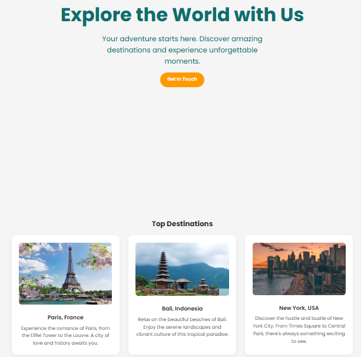

```markdown
# 🌍 Travel Agency Website

A modern, responsive travel agency landing page built with HTML and CSS. Showcasing popular destinations, personalized services, client testimonials, and an easy contact form.

---

## ✨ Features

- **Hero Section**: Eye-catching intro with background image and call-to-action.
- **Top Destinations**: Highlights 3 major travel locations with descriptions and images.
- **Services Section**: Unique horizontal layout with images and descriptions to showcase offerings.
- **Client Testimonials**: Grid-style feedback from happy travelers.
- **Contact Form**: Fully functional contact form structure for user inquiries.
- **Responsive Design**: Works well on desktop, tablet, and mobile devices.

---

## 📁 File Structure
```

landingpage/
│
├── index.html # Main HTML file
├── styles.css # All CSS styles
├── images/ # Folder with all images used in the site
│ ├── Paris.jpg
│ ├── Bali.jpg
│ ├── NY.jpg
│ ├── package.jpg
│ ├── 24 7 Hours.jpg
│ ├── guided.jpg
│ ├── user1.jpg
│ ├── user2.jpg
│ ├── user3.jpg
│ └── hero-image.jpg
├── LICENSE  
├── README.md

````

---

## 📷 Preview



---

## 🚀 Getting Started

1. **Clone the repo**
   ```bash
   git clone git@github.com:pprachhiii/landingpage.git
````

2. **Open in browser**  
   Simply open `index.html` in your browser.

3. **Customize**
   - Replace placeholder images in `/images`
   - Update text, destinations, services, or testimonials
   - Hook up the form to a real backend (`your-form-handler.php`)

---

## 🛠 Tech Stack

- HTML5
- CSS3 (No framework)
- Google Fonts (Poppins)

---

### 🔗 Live Demo

Check out the live app here: [Travel Agency](https://landingpage-iota-beige.vercel.app/)

## 📸 Screenshots


## 📬 Contact

Made with ❤️ by Prachi Yadav

> Feel free to fork this repo or open an issue if you’d like to contribute or have suggestions!

## 🪪 License

MIT — Copyright © 2025 Prachi Yadav
See [LICENSE](./LICENSE) for full text.

---

```

```
